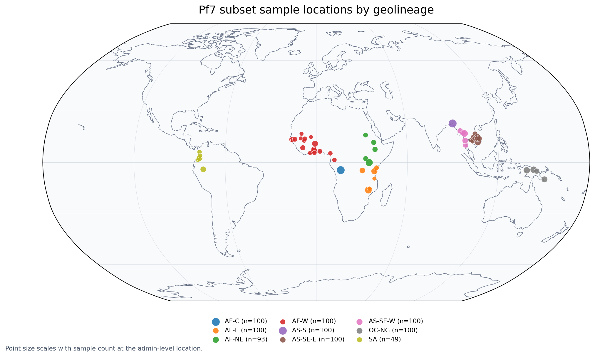

# Afanc modelling example

This directory contains a compact *Plasmodium falciparum* geolineage modelling
example. It uses an Ardal allele presence or absence matrix and Pf7 sample
metadata to build sparse lineage classifiers with leave-one-study-out or
leave-one-country-out validation.

The packaged subset is intended as a reproducible example, not the full training
set used by Afanc. It contains the top samples by callability within each
geolineage cohort, so model performance may differ from production models.

## Files

| path | description |
|---|---|
| `pf_geolineage_example.ipynb` | Worked notebook for loading the data, examining metadata, training a hierarchical geolineage model, and exporting model JSON. |
| `loso_sparse_model.py` | Hierarchical sparse model builder used by the notebook. |
| `minimal_empirical_loso.py` | Minimal flat empirical leave-one-group-out model builder. |
| `minimal_bayesian_loso.py` | Minimal flat semi-Bayesian leave-one-group-out model builder. |
| `model_json_library.py` | Model JSON schema helpers and writers. |
| `data/Pf7_subset.bin.zst` | Compressed Ardal sparse allele matrix. |
| `data/Pf7_subset.bin.meta.gz` | Compressed Ardal matrix metadata. |
| `data/Pf7_subset_meta.csv` | Sample metadata used for geolineage labels and validation groups. |
| `sample_locations_by_geolineage.png` | Static map of sample locations coloured by geolineage. |

## Metadata

The sample metadata file has 842 rows and 18 columns. It contains 842 unique
sample IDs and 810 unique ENA accessions collected between 2001 and 2017.

Key columns:

| column | use |
|---|---|
| `Sample` | Sample identifier used to match rows to the Ardal matrix. |
| `ENA` | Sequence read archive accession. |
| `Study` | Source study identifier. |
| `Country` | Country label used by the worked notebook as the hold-out group. |
| `Admin level 1` | Sub-country location label. |
| `Country latitude`, `Country longitude` | Country centroid coordinates. |
| `Admin level 1 latitude`, `Admin level 1 longitude` | Preferred plotting coordinates where available. |
| `Year` | Collection year. |
| `Population` | Geolineage label used as the model target. |
| `% callable` | Sample callability used when selecting this example subset. |
| `QC pass`, `Exclusion reason` | Pf7 quality-control status fields. |
| `Sample type` | Input material category, such as `gDNA` or `sWGA`. |
| `Sample was in Pf7` | Whether the sample was included in Pf7. |

Geolineage counts:

| geolineage | samples |
|---|---:|
| `AF-C` | 100 |
| `AF-E` | 100 |
| `AF-W` | 100 |
| `AS-S` | 100 |
| `AS-SE-E` | 100 |
| `OC-NG` | 100 |
| `AS-SE-W` | 100 |
| `AF-NE` | 93 |
| `SA` | 49 |

## Sample locations

The map below uses admin-level coordinates when present and falls back to
country coordinates otherwise. Points are coloured by `Population`, and point
size scales with the number of samples at that location.



## Running the example

The notebook installs the required Python packages in its first code cell. For a
local environment, install Ardal and the analysis dependencies before opening the
notebook:

```bash
pip install "git+https://github.com/ArthurVM/Ardal.git"
pip install --upgrade pandas plotly "nbformat>=5.10.4" scikit-learn scipy zstandard
```

Then open and run:

```bash
jupyter notebook pf_geolineage_example.ipynb
```

The notebook expects these relative paths:

```python
MATRIX_DATA = ["./data/Pf7_subset.bin.zst", "./data/Pf7_subset.bin.meta.gz"]
METADATA_CSV = "./data/Pf7_subset_meta.csv"
```

The Ardal allele ID format used by the worked example is:

```python
allele_id_format = "{chr}.{start}.{alt}"
```

## Programmatic use

The modules can also be imported directly. For example, the hierarchical builder
used by the notebook is exposed as:

```python
from loso_sparse_model import build_geolineage_min_model_sparse, write_model_json

final_model, fold_results_by_node = build_geolineage_min_model_sparse(
    ard_obj=ard_obj,
    meta_df=meta,
    parent_map=parent_map,
    sample_col="Sample",
    lineage_col="Population",
    study_col="Country",
)

write_model_json(final_model, "pf_geolineage_example_model.json")
```

`study_col` can be set to a different metadata column if another held-out group
definition is required.
